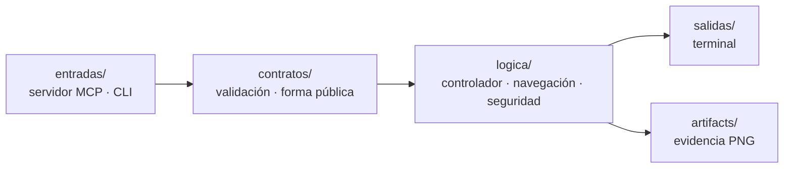

<h1 align="center">Android MCP Harness</h1>

<p align="center">
  <strong>Un modelo de lenguaje que usa un Android de verdad — sin tocar un solo píxel a ciegas.</strong>
</p>

<p align="center">
  <a href="https://github.com/dajarony/android-mcp-harness/actions/workflows/ci.yml"></a>
  <a href="https://github.com/dajarony/android-mcp-harness/actions/workflows/eca.yml"></a>
  
  
  
  
  
</p>

---

## El problema

Dar control de un teléfono a un agente suele resolverse de la peor manera posible:
una herramienta `adb shell <lo que sea>` y una captura de pantalla para que el
modelo adivine dónde pulsar. Eso es un intérprete de comandos remoto con acento
de IA — sin contrato, sin límites, sin pruebas y sin rastro de lo que pasó.

Este arnés hace lo contrario. **Cada capacidad se declara antes de existir**, el
modelo nunca envía coordenadas, y toda acción que cambia algo deja una prueba en
disco.

```text
Cliente MCP  →  stdio  →  Arnés  →  Appium  →  UiAutomator2  →  ADB  →  Emulador Android
                          ▲
                          └── contrato · guardias · bloqueo único · evidencia
```

---

## Qué sabe hacer

Doce herramientas. Ni una más de las declaradas.

### 👁️ Observar — no cambian nada de lo que se ve

| Herramienta | Parámetros | Devuelve |
|---|---|---|
| `emulator.get_status` | — | UDID, versión de Android, modelo y versión de Appium |
| `ui.get_tree` | `include_raw?`, `session_id?` | Lo que la pantalla **dice** y lo que se puede **pulsar**, con el selector de cada objetivo |
| `screen.capture` | — | PNG en `artifacts/` + su `artifact_id` y su `uri` legible |
| `app.list_installed` | — | Identificadores de paquete instalados |

Las cuatro van por **ADB de solo lectura**. No abren sesión de Appium a
propósito: crear una sesión puede traer una app al primer plano, y eso
violaría la promesa de que observar no navega.

### ✋ Actuar — cada una deja evidencia

| Herramienta | Parámetros | Qué hace |
|---|---|---|
| `app.open` | `package_name` | Resuelve la actividad `MAIN/LAUNCHER` del paquete y la lanza |
| `ui.session.open` | — | Reserva una cadena exclusiva de UI durante un tiempo acotado |
| `ui.session.close` | `session_id` | Cierra esa cadena y libera el emulador |
| `ui.tap` | `selector`, `session_id?` | Pulsa **un** elemento localizado por semántica |
| `ui.type_text` | `selector`, `text`, `session_id?` | Escribe texto acotado en un campo |
| `ui.scroll` | `direction` (`up` \| `down`), `session_id?` | Un gesto vertical normalizado |
| `device.back` | `session_id?` | Una navegación Atrás |
| `settings.open_apps` | — | El flujo de demostración: Ajustes → Apps |

**El modelo nunca manda coordenadas.** El objetivo de un selector es exactamente
una de estas cinco claves. Cuando la misma etiqueta aparece varias veces, puede
llevar además un `within` con un único ancestro semántico que el propio árbol ha
publicado:

```jsonc
{"resource_id": "com.android.settings:id/search"}   // id de recurso
{"text":        "Calendar"}                          // texto exacto
{"content_desc":"Search"}                            // etiqueta accesible
{"text_contains":"Calen"}                            // texto parcial
{"input_hint": "Search"}                             // campo por su pista
{"text":"Save", "within":{"content_desc":"Personal profile"}} // contexto semántico
```

Un valor de selector puede llevar saltos de línea, porque Flutter funde los
textos de un widget en una sola descripción separada por ellos: `Historial\nTab
2 of 3` es como esa pestaña se llama de verdad.

Si nada encaja, la respuesta es `UI_ELEMENT_NOT_FOUND` con una captura del
momento — y **con lo que la pantalla sí ofrece**:

```text
No visible element matched 'input_hint' before timeout.
The screen offers: 'Android Auto' (button), 'Calendar' (button),
                   'Search…' (input), 'More options' (button).
```

Un callejón sin salida que nombra las alternativas es un reintento, no un
callejón. Nunca hay un plan B de "pulsa en el centro y a ver qué pasa".

### El bucle se cierra solo

`ui.get_tree` no devuelve el volcado XML. Devuelve **la pantalla traducida al
vocabulario que el propio servidor acepta**:

```json
{
  "foreground_package": "com.android.settings",
  "texts": ["All apps", "Calendar", "Clock", "…"],
  "actions": [
    {"selector": {"text": "Calendar"}, "label": "Calendar", "role": "button",
     "enabled": true, "bounds": {"left": 0, "top": 525, "width": 1080, "height": 199}},
    {"selector": {"resource_id": "…:id/q"}, "label": "Search", "role": "input", "enabled": true},
    {"selector": {"text": "Clock"}, "label": "Clock", "role": "button", "ambiguous": true},
    {"selector": {"content_desc": "Historial\nTab 2 of 3"}, "label": "Historial",
     "role": "button", "covered_by_keyboard": true}
  ],
  "can_scroll": true,
  "keyboard": {"open": true, "top": 1517}
}
```

Lo que sale de `ui.get_tree` entra tal cual en `ui.tap`. El modelo no interpreta
XML, no calcula posiciones y no adivina: lee, elige una entrada y la envía.

Cuatro detalles que importan:

- **`role`** distingue lo que se pulsa de lo que se escribe de lo que se
  conmuta, para que el modelo no intente teclear en un botón.
- **`within`** desambigua una etiqueta repetida con un ancestro semántico, por
  ejemplo “Save dentro de Personal profile”. Si no existe tal contexto,
  **`ambiguous`** permanece: pulsar sería una moneda al aire, y es mejor decirlo
  que fallar en silencio.
- **Lo tapado por el teclado se avisa.** El volcado de Android describe la
  ventana como si el teclado no estuviera encima, así que la barra de pestañas
  se leía disponible y no se podía tocar. Ahora llega `covered_by_keyboard` y un
  `keyboard: {open, top}`. No se oculta el objetivo: ocultarlo sería mentir por
  omisión, y `device.back` cierra el teclado.
- **Los scrollables no se listan** como objetivos: `ui.scroll` actúa sobre la
  pantalla y no acepta selector, así que ofrecerlos sería inventar un blanco.

El volcado completo sigue disponible con `include_raw: true` para depurar un
selector a mano. Simplemente ha dejado de ser el precio de mirar la pantalla:
**17.508 bytes de XML frente a 1.815 del resumen, un 90 % menos**, medido sobre
la lista de aplicaciones de Ajustes.

### Lo visual, hasta donde una máquina puede jurarlo

`bounds` viaja en cada acción y el arnés comprueba lo que es aritmética, no gusto:

```json
{"issue": "touch_target_too_small", "selector": {"text": "Guardar"},
 "size_px": [40, 40], "minimum_px": 126}
```

Tres comprobaciones, y solo tres, porque son las únicas inequívocas: un elemento
**fuera de la pantalla**, uno **sin área**, y un control **más pequeño que una
yema de dedo en los dos ejes** (los 48 dp de Android, convertidos con la densidad
real del dispositivo). Una fila ancha recortada por el scroll **no** se denuncia:
sería un falso positivo, y el objetivo declarado es cero.

Si algo es bonito no se comprueba. Si un botón está fuera de la pantalla, sí.

> **La posición sale, nunca entra.** `bounds` se publica para auditar y jamás se
> acepta como selector. Leer dónde está algo y apuntar a un píxel son dos poderes
> distintos, y solo el primero es seguro de ceder.

### La evidencia se puede ver, no solo citar

Cada captura se expone además como recurso MCP:

```text
artifact://20260814-004916-785289-screen.png
```

Un cliente que no comparta disco con el arnés lee ahí la imagen. El recurso solo
sirve identificadores con la forma exacta que el arnés emite y comprueba que la
ruta resuelta siga dentro de `artifacts/`: un recorrido de directorios no es
representable.

**Y la captura tiene que mostrar algo.** Un emulador sin ventana o con la pila
gráfica rota responde a `screencap` con un PNG perfectamente válido de un solo
color plano, y cualquier comprobación que solo mirase los bytes mágicos lo daría
por bueno. El arnés decodifica la imagen con la biblioteca estándar —sin
dependencias— y si todos los píxeles son idénticos devuelve
`EVIDENCE_WRITE_FAILED`. Un fichero que existe no es una prueba.

---

## Lo que se niega a hacer

Un arnés serio se define por lo que **no** expone:

- ❌ **No hay `adb shell` arbitrario.** Cada comando ADB está escrito a mano en
  el código. La lista es cerrada.
- ❌ **No abre puertos.** El transporte es stdio. Cero red.
- ❌ **No acepta coordenadas.** Ni del modelo, ni del cliente, ni por accidente.
- ❌ **No usa el intérprete de comandos del sistema.** Todo va por `subprocess`
  con lista de argumentos: `;`, `&&`, `../..` y `--flags` mueren en la validación.
- ❌ **No deja sesiones huérfanas.** Sin `session_id`, cada acción abre su
  sesión, la usa y la cierra en `finally`. Un flujo explícito se cierra con
  `ui.session.close`, tras 60 s de inactividad o si vence su techo de acción.
- ❌ **No hay dos dueños del emulador.** Un bloqueo único; la segunda operación
  simultánea recibe `EMULATOR_BUSY` de inmediato, sin cola.

---

## Una respuesta, siempre la misma forma

Toda herramienta —éxito o fallo— devuelve el mismo contrato:

```json
{
  "ok": true,
  "operation_id": "7f3c…",
  "tool": "ui.tap",
  "data": { "target": {"text": "Calendar"}, "element_label": "Calendar",
            "foreground_package": "com.android.settings" },
  "evidence": { "artifact_id": "20260813-231622-282673-ui-tap.png",
                "path": "artifacts/20260813-231622-282673-ui-tap.png" },
  "error": null
}
```

En fallo: `ok: false`, `data: {}`, y `error` con un código tipado de esta lista —
`EMULATOR_UNAVAILABLE`, `APPIUM_UNAVAILABLE`, `EMULATOR_BUSY`,
`UI_ELEMENT_NOT_FOUND`, `UI_TREE_UNAVAILABLE`, `INVALID_SELECTOR`,
`INVALID_TEXT`, `INVALID_PACKAGE`, `INVALID_SCROLL_DIRECTION`, `APP_NOT_FOUND`,
`SETTINGS_FOREGROUND_FAILED`, `OPERATION_TIMEOUT`, `EVIDENCE_WRITE_FAILED`,
`INTERNAL_ERROR`.

Cada `operation_id` es único e irrepetible: sirve para correlacionar lo que pidió
el modelo con el PNG que quedó en disco.

---

## Cómo está construido

Arquitectura **SUME**: cada carpeta es una responsabilidad, cada fichero declara
su contrato en cabecera.



| Carpeta | Responsabilidad |
|---|---|
| `entradas/` | Puertas: servidor MCP por stdio y comando de terminal |
| `contratos/` | Validación de intenciones y forma pública de las respuestas |
| `logica/seguridad/` | Guardias: qué UDID y qué Appium son aceptables |
| `logica/infraestructura/` | Adaptadores ADB y Appium, comandos fijos |
| `logica/navegacion/` | Lectura del árbol, selección semántica, auditoría de maqueta y localizadores; sin coordenadas |
| `logica/servicios/mcp_server/` | Fachada MCP, ejecución acotada de Appium y bloqueo de exclusividad |
| `logica/evidencias/` | Rutas únicas de evidencia, a prueba de reintentos |
| `docs/faser/` · `docs/eca/` | El contrato escrito **antes** del código y su oráculo |

Mapa completo en [`mapa-global/arquitectura.yaml`](mapa-global/arquitectura.yaml)
y bitácora en [`cambios/registro-cambios.md`](cambios/registro-cambios.md).

La división interna del servidor evita que una pieza mezcle responsabilidades:

| Módulo | Una responsabilidad |
|---|---|
| `navegacion/arbol.py` | Convertir XML Android en nodos visibles y sus ancestros. |
| `navegacion/objetivos.py` | Elegir roles, selectores y contexto `within` sin actuar sobre la pantalla. |
| `navegacion/maqueta.py` | Medir bounds, teclado, zonas táctiles y solapes. |
| `navegacion/resumen.py` | Orquestar las tres lecturas anteriores y publicar el resumen estable. |
| `mcp_server/controller.py` | Exponer las doce herramientas, validar sus entradas y coordinar adaptadores. |
| `mcp_server/ejecutor_ui.py` | Ejecutar llamadas Appium con techo, evidencia y cierre seguro del driver. |

La API MCP no cambia con esta división: es una frontera interna para que XML,
decisiones semánticas y Appium no vuelvan a crecer en el mismo fichero.

---

## ¿Me falta algo?

```powershell
.\.venv\Scripts\python -m entradas.comandos.doctor
```

Comprueba las ocho piezas de una vez y, por cada una que falte, dice qué hacer.
No se para en la primera: ir descubriendo obstáculos de uno en uno convierte la
instalación en un juego de adivinanzas.

```text
[ok  ] Python              3.13.5
[MISS] Java                java version "1.8.0_491" is Java 8, older than 17
[ok  ] ADB                 .../platform-tools/adb.exe
[MISS] Emulator            The configured Android emulator is unavailable in ADB.

2 of 8 checks block a real campaign:
  Java: Install JDK 17 and put its bin directory first on PATH, or set JAVA_HOME.
  Emulator: Start a disposable AVD so that 'emulator-5554' comes online.
```

Ese `java` de la primera ejecución era real: comprobar que un programa *existe*
es como se pasa una revisión y se falla una hora después.

## Probarlo sin instalar nada

```bash
docker build -t android-mcp-harness .
docker run --rm android-mcp-harness
```

El banco entero en unos ocho segundos, sin Python, sin Node y sin SDK en tu
máquina. El número exacto de pruebas lo dice el propio comando, así que este
párrafo no envejece.

**El emulador no está dentro, a propósito.** Necesitaría `/dev/kvm`, que Docker
Desktop en Windows y macOS no cede de forma fiable, y el driver UiAutomator2
reenvía puertos del dispositivo a través del servidor ADB: esos reenvíos
aparecerían en el anfitrión y serían inalcanzables desde dentro. Prometer lo
contrario sería una promesa que nadie ha probado.

Lo que la imagen sí demuestra: los contratos se cumplen, el banco pasa y el
servidor MCP arranca por stdio real publicando exactamente su catálogo. La
campaña contra un AVD sigue siendo nativa, y `doctor` dice qué falta para ella.

## Puesta en marcha

**Necesitas:** Python 3.13, JDK 17, Android SDK con un AVD, y Node para Appium.

```powershell
# 1. Emulador desechable
emulator -avd Medium_Phone

# 2. Cliente Python
python -m venv .venv
.\.venv\Scripts\python -m pip install -r requirements.txt

# 3. Appium (otra terminal)
npm install
$env:JAVA_HOME   = 'C:\Program Files\Eclipse Adoptium\jdk-17'
$env:ANDROID_HOME = "$env:LOCALAPPDATA\Android\Sdk"
$env:Path = "$env:JAVA_HOME\bin;$env:ANDROID_HOME\platform-tools;$env:Path"
.\node_modules\.bin\appium.cmd

# 4. Demostración de humo
.\.venv\Scripts\python main.py
```

### Conectarlo a un cliente MCP

```json
{
  "mcpServers": {
    "android-harness": {
      "command": "C:/ruta/al/repo/.venv/Scripts/python.exe",
      "args": ["-m", "entradas.mcp.server"],
      "cwd": "C:/ruta/al/repo",
      "env": { "ANDROID_UDID": "emulator-5554",
               "APPIUM_URL": "http://127.0.0.1:4723" }
    }
  }
}
```

### Cliente de referencia: una tarea real, declarada

El cliente de referencia abre una app, observa la pantalla, encadena los pasos
semánticos bajo una sesión temporal y escribe un informe JSON con cada resultado
y evidencia. Copia y adapta
[`docs/reference-flow.example.json`](docs/reference-flow.example.json): los
selectores deben salir de `ui.get_tree` de tu propia app, no inventarse.

```powershell
.\.venv\Scripts\python -m entradas.comandos.cliente_referencia docs/reference-flow.example.json
```

El ejemplo usa un paquete ficticio: sustituye `package_name` por el de la app
Flutter instalada en el AVD y sus pasos por la tarea que quieres verificar.

Para la APK local de Auralis Compra, el flujo seguro de exploración vive en
[`docs/auralis-compra-exploration-flow.example.json`](docs/auralis-compra-exploration-flow.example.json).
Parte de la pestaña Lista, solo visita Historial y Ajustes, y no añade artículos
ni accede a presupuesto o pago.

Solo dos variables. Ambas apuntan a tu máquina y tienen valor por defecto.

---

## Verificación

El proyecto no se cree a sí mismo: se mide.

```powershell
# Banco unitario (sin dispositivo)
.\.venv\Scripts\python -m unittest discover -s tests -v

# Campaña contra el emulador real
$env:ANDROID_MCP_RUN_EMULATOR = '1'
.\.venv\Scripts\python -m unittest tests.test_mcp_emulator_e2e -v
```

La campaña comprueba las promesas, no las funciones: que observar no navega, que
dos capturas seguidas no se pisan, que la navegación llega a donde dice y deja
prueba, que dos operaciones simultáneas no comparten el emulador, y que un
cliente MCP externo ve el mismo catálogo a través de stdio real.

El oráculo — la verdad escrita por una persona, contra la que se compara todo —
vive en [`docs/eca/mcp-emulator-v1.md`](docs/eca/mcp-emulator-v1.md) y **no se
edita para convertir un fallo en verde**.

En CI hay dos flujos y la separación es deliberada:

| Flujo | Cuándo | ¿Bloquea? |
|---|---|---|
| [`ci.yml`](.github/workflows/ci.yml) | Cada push y cada PR | Sí — banco unitario en Python 3.12 y 3.13, más el catálogo MCP por stdio real |
| [`eca.yml`](.github/workflows/eca.yml) | Semanal y a demanda | No — arranca un AVD y Appium de verdad y sube la evidencia |

Un emulador en CI es lento y a veces caprichoso. Una puerta que falla sin culpa
del código enseña a la gente a ignorar el rojo, así que la campaña real informa
en vez de bloquear, y sus capturas quedan como artefacto descargable.

---

## Estado y límites honestos

Un proyecto que esconde dónde no llega no es serio. Esto es lo que hay:

- ✅ **Verificado en local**: Android 16 (API 36), Appium 3.6, emulador
  `emulator-5554`. Presupuesto de ≤30 s por llamada cumplido con holgura.
- ✅ **Sin sesiones huérfanas**, medido: se pregunta a Appium cuántas sesiones
  tiene antes y después de una tanda con éxitos y con fallos.
- ✅ **Dos niveles de API en verde** (34 y 36), en máquinas que no son la mía.
  Llegar ahí costó seis vueltas y descubrió que el buscador de Ajustes es una
  clase distinta en cada versión de Android.
- ✅ **Probado contra una aplicación Flutter ajena**, no solo contra Ajustes.
  Ese recorrido encontró tres fallos del propio arnés y devolvió un informe de
  accesibilidad utilizable sobre la app.
- ⚠️ **Una capa de fabricante** encima de Android sigue pudiendo mover selectores
  y tiempos. No está probado.
- ⚠️ **El resumen es una opinión sobre la pantalla.** Marca lo ambiguo, pero un
  diseño que no expone ni texto, ni `content-desc`, ni `resource-id` sigue sin
  ser accionable por semántica — y eso es un problema de la app, no del arnés.
- ⚠️ **`ui.scroll` solo publica `up` y `down`.** El gesto horizontal está escrito
  y probado en la capa de navegación, pero no sale al catálogo: no hay campaña
  que lo mida contra un carrusel real, y una capacidad sin promesa verificable no
  pertenece a la superficie pública. Entra cuando exista su fila de oráculo.
- ✅ **Las acciones pueden encadenarse de forma explícita.** `ui.session.open`
  devuelve un identificador opaco para `ui.tap`, `ui.type_text`, `ui.scroll` y
  `device.back`; la sesión caduca tras 60 s sin uso (configurable con
  `ANDROID_MCP_FLOW_IDLE_TIMEOUT`) y se puede liberar antes con
  `ui.session.close`. Sin ese identificador, cada acción conserva el cierre
  inmediato de sesión original.
- ✅ **Una llamada colgada no puede bloquear a todos.** Pasados 90 s
  (`ANDROID_MCP_ACTION_TIMEOUT`) el arnés deja de esperar, devuelve
  `OPERATION_TIMEOUT`, anula el arriendo del flujo y suelta el emulador. Es un
  techo de seguridad, no el presupuesto declarado de ≤30 s. El hilo abandonado
  sigue corriendo hasta terminar solo: un hilo no se puede matar, y se dice en
  vez de fingir lo contrario.
- 🚫 **No integra agentes todavía.** Auralis, Trinidad y Glas serán *clientes*
  de esta frontera — nunca una ampliación de su autoridad.

---

## Hacia dónde va

- [x] Guardias de configuración aplicados en **todas** las puertas, no solo en las de lectura
- [x] Contrato FASER al día con las doce herramientas
- [x] Espera activa antes de declarar que una app no se abrió
- [x] Árbol UI resumido y filtrado en vez de XML crudo
- [x] Evidencia legible como recurso MCP, no como ruta
- [x] Segundo nivel de API en la campaña
- [ ] Un AVD con capa de fabricante, no solo imágenes de Google
- [x] Una prueba que recorra las dos piezas juntas: todo lo que el resumen ofrece, el localizador lo encuentra
- [ ] Una campaña E2E para publicar `ui.scroll` horizontal en un carrusel real
- [x] Encadenar acciones sin perder el estado entre sesiones
- [x] `ui.tap` capaz de desambiguar sin recurrir a coordenadas
- [x] Un cliente de referencia que recorra una app real de principio a fin

---

## Licencia

MIT.
