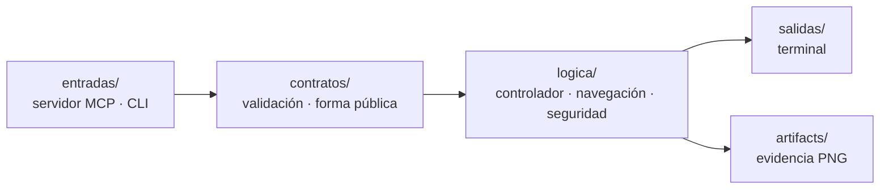

<h1 align="center">Android MCP Harness</h1>

<p align="center">
  <strong>Un modelo de lenguaje que usa un Android de verdad — sin tocar un solo píxel a ciegas.</strong>
</p>

<p align="center">
  <a href="https://github.com/dajarony/android-mcp-harness/actions/workflows/ci.yml"></a>
  <a href="https://github.com/dajarony/android-mcp-harness/actions/workflows/eca.yml"></a>
  
  
  
  
  
</p>

---

## El problema

Dar control de un teléfono a un agente suele resolverse de la peor manera posible:
una herramienta `adb shell <lo que sea>` y una captura de pantalla para que el
modelo adivine dónde pulsar. Eso es un intérprete de comandos remoto con acento
de IA — sin contrato, sin límites, sin pruebas y sin rastro de lo que pasó.

Este arnés hace lo contrario. **Cada capacidad se declara antes de existir**, el
modelo nunca envía coordenadas, y toda acción que cambia algo deja una prueba en
disco.

```text
Cliente MCP  →  stdio  →  Arnés  →  Appium  →  UiAutomator2  →  ADB  →  Emulador Android
                          ▲
                          └── contrato · guardias · bloqueo único · evidencia
```

---

## Qué sabe hacer

Diez herramientas. Ni una más de las declaradas.

### 👁️ Observar — no cambian nada de lo que se ve

| Herramienta | Parámetros | Devuelve |
|---|---|---|
| `emulator.get_status` | — | UDID, versión de Android, modelo y versión de Appium |
| `ui.get_tree` | — | Jerarquía de accesibilidad completa de la pantalla actual |
| `screen.capture` | — | PNG guardado en `artifacts/` + su identificador |
| `app.list_installed` | — | Identificadores de paquete instalados |

Las cuatro van por **ADB de solo lectura**. No abren sesión de Appium a
propósito: crear una sesión puede traer una app al primer plano, y eso
violaría la promesa de que observar no navega.

### ✋ Actuar — cada una deja evidencia

| Herramienta | Parámetros | Qué hace |
|---|---|---|
| `app.open` | `package_name` | Resuelve la actividad `MAIN/LAUNCHER` del paquete y la lanza |
| `ui.tap` | `selector` | Pulsa **un** elemento localizado por semántica |
| `ui.type_text` | `selector`, `text` | Escribe texto acotado en un campo |
| `ui.scroll` | `direction` (`up` \| `down`) | Un gesto vertical normalizado |
| `device.back` | — | Una navegación Atrás |
| `settings.open_apps` | — | El flujo de demostración: Ajustes → Apps |

**El modelo nunca manda coordenadas.** Un selector es exactamente una de estas
cinco claves, y solo una:

```jsonc
{"resource_id": "com.android.settings:id/search"}   // id de recurso
{"text":        "Calendar"}                          // texto exacto
{"content_desc":"Search"}                            // etiqueta accesible
{"text_contains":"Calen"}                            // texto parcial
{"input_hint": "Search"}                             // campo por su pista
```

Si nada encaja, la respuesta es `UI_ELEMENT_NOT_FOUND` con una captura del
momento. Nunca hay un plan B de "pulsa en el centro y a ver qué pasa".

---

## Lo que se niega a hacer

Un arnés serio se define por lo que **no** expone:

- ❌ **No hay `adb shell` arbitrario.** Cada comando ADB está escrito a mano en
  el código. La lista es cerrada.
- ❌ **No abre puertos.** El transporte es stdio. Cero red.
- ❌ **No acepta coordenadas.** Ni del modelo, ni del cliente, ni por accidente.
- ❌ **No usa el intérprete de comandos del sistema.** Todo va por `subprocess`
  con lista de argumentos: `;`, `&&`, `../..` y `--flags` mueren en la validación.
- ❌ **No deja sesiones huérfanas.** Cada acción abre su sesión, la usa y la
  cierra en `finally`, pase lo que pase.
- ❌ **No hay dos dueños del emulador.** Un bloqueo único; la segunda operación
  simultánea recibe `EMULATOR_BUSY` de inmediato, sin cola.

---

## Una respuesta, siempre la misma forma

Toda herramienta —éxito o fallo— devuelve el mismo contrato:

```json
{
  "ok": true,
  "operation_id": "7f3c…",
  "tool": "ui.tap",
  "data": { "target": {"text": "Calendar"}, "element_label": "Calendar",
            "foreground_package": "com.android.settings" },
  "evidence": { "artifact_id": "20260813-231622-282673-ui-tap.png",
                "path": "artifacts/20260813-231622-282673-ui-tap.png" },
  "error": null
}
```

En fallo: `ok: false`, `data: {}`, y `error` con un código tipado de esta lista —
`EMULATOR_UNAVAILABLE`, `APPIUM_UNAVAILABLE`, `EMULATOR_BUSY`,
`UI_ELEMENT_NOT_FOUND`, `UI_TREE_UNAVAILABLE`, `INVALID_SELECTOR`,
`INVALID_TEXT`, `INVALID_PACKAGE`, `INVALID_SCROLL_DIRECTION`, `APP_NOT_FOUND`,
`SETTINGS_FOREGROUND_FAILED`, `OPERATION_TIMEOUT`, `EVIDENCE_WRITE_FAILED`,
`INTERNAL_ERROR`.

Cada `operation_id` es único e irrepetible: sirve para correlacionar lo que pidió
el modelo con el PNG que quedó en disco.

---

## Cómo está construido

Arquitectura **SUME**: cada carpeta es una responsabilidad, cada fichero declara
su contrato en cabecera.



| Carpeta | Responsabilidad |
|---|---|
| `entradas/` | Puertas: servidor MCP por stdio y comando de terminal |
| `contratos/` | Validación de intenciones y forma pública de las respuestas |
| `logica/seguridad/` | Guardias: qué UDID y qué Appium son aceptables |
| `logica/infraestructura/` | Adaptadores ADB y Appium, comandos fijos |
| `logica/navegacion/` | Traducción de semántica a localizadores, sin coordenadas |
| `logica/servicios/mcp_server/` | Controlador y bloqueo de exclusividad |
| `logica/evidencias/` | Rutas únicas de evidencia, a prueba de reintentos |
| `docs/faser/` · `docs/eca/` | El contrato escrito **antes** del código y su oráculo |

Mapa completo en [`mapa-global/arquitectura.yaml`](mapa-global/arquitectura.yaml)
y bitácora en [`cambios/registro-cambios.md`](cambios/registro-cambios.md).

---

## Puesta en marcha

**Necesitas:** Python 3.13, JDK 17, Android SDK con un AVD, y Node para Appium.

```powershell
# 1. Emulador desechable
emulator -avd Medium_Phone

# 2. Cliente Python
python -m venv .venv
.\.venv\Scripts\python -m pip install -r requirements.txt

# 3. Appium (otra terminal)
npm install
$env:JAVA_HOME   = 'C:\Program Files\Eclipse Adoptium\jdk-17'
$env:ANDROID_HOME = "$env:LOCALAPPDATA\Android\Sdk"
$env:Path = "$env:JAVA_HOME\bin;$env:ANDROID_HOME\platform-tools;$env:Path"
.\node_modules\.bin\appium.cmd

# 4. Demostración de humo
.\.venv\Scripts\python main.py
```

### Conectarlo a un cliente MCP

```json
{
  "mcpServers": {
    "android-harness": {
      "command": "C:/ruta/al/repo/.venv/Scripts/python.exe",
      "args": ["-m", "entradas.mcp.server"],
      "cwd": "C:/ruta/al/repo",
      "env": { "ANDROID_UDID": "emulator-5554",
               "APPIUM_URL": "http://127.0.0.1:4723" }
    }
  }
}
```

Solo dos variables. Ambas apuntan a tu máquina y tienen valor por defecto.

---

## Verificación

El proyecto no se cree a sí mismo: se mide.

```powershell
# Banco unitario (sin dispositivo)
.\.venv\Scripts\python -m unittest discover -s tests -v

# Campaña contra el emulador real
$env:ANDROID_MCP_RUN_EMULATOR = '1'
.\.venv\Scripts\python -m unittest tests.test_mcp_emulator_e2e -v
```

La campaña comprueba las promesas, no las funciones: que observar no navega, que
dos capturas seguidas no se pisan, que la navegación llega a donde dice y deja
prueba, que dos operaciones simultáneas no comparten el emulador, y que un
cliente MCP externo ve el mismo catálogo a través de stdio real.

El oráculo — la verdad escrita por una persona, contra la que se compara todo —
vive en [`docs/eca/mcp-emulator-v1.md`](docs/eca/mcp-emulator-v1.md) y **no se
edita para convertir un fallo en verde**.

En CI hay dos flujos y la separación es deliberada:

| Flujo | Cuándo | ¿Bloquea? |
|---|---|---|
| [`ci.yml`](.github/workflows/ci.yml) | Cada push y cada PR | Sí — banco unitario en Python 3.12 y 3.13, más el catálogo MCP por stdio real |
| [`eca.yml`](.github/workflows/eca.yml) | Semanal y a demanda | No — arranca un AVD y Appium de verdad y sube la evidencia |

Un emulador en CI es lento y a veces caprichoso. Una puerta que falla sin culpa
del código enseña a la gente a ignorar el rojo, así que la campaña real informa
en vez de bloquear, y sus capturas quedan como artefacto descargable.

---

## Estado y límites honestos

Un proyecto que esconde dónde no llega no es serio. Esto es lo que hay:

- ✅ **Verificado en local**: Android 16 (API 36), Appium 3.6, emulador
  `emulator-5554`. Presupuesto de ≤30 s por llamada cumplido con holgura.
- ⚠️ **Un solo AVD probado.** Otro nivel de API o una capa de fabricante puede
  mover selectores y tiempos.
- ⚠️ **Sin reintentos** en la cadena de observación: un hipo puntual de
  `uiautomator dump` se convierte en una llamada fallida.
- ⚠️ **`screen.capture` devuelve una ruta local**, no la imagen: hoy asume que
  cliente y arnés comparten sistema de ficheros.
- 🚫 **No integra agentes todavía.** Auralis, Trinidad y Glas serán *clientes*
  de esta frontera — nunca una ampliación de su autoridad.

---

## Hacia dónde va

- [ ] Guardias de configuración aplicados en **todas** las puertas, no solo en las de lectura
- [ ] Contrato FASER al día con las diez herramientas
- [ ] Espera activa antes de declarar que una app no se abrió
- [ ] Árbol UI resumido y filtrado en vez de XML crudo
- [ ] Evidencia devuelta como contenido MCP, no como ruta
- [ ] Segundo AVD y segundo nivel de API en la campaña

---

## Licencia

ISC.
